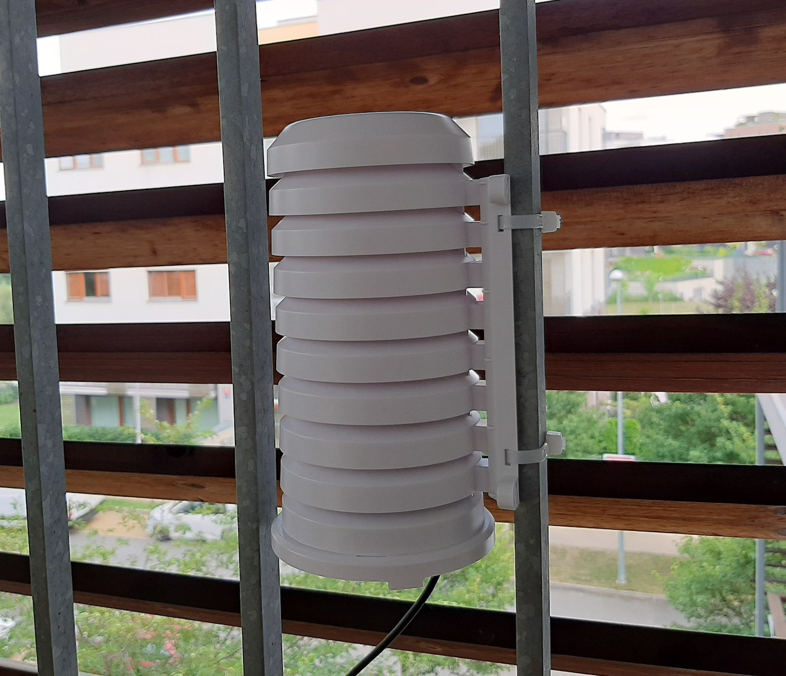
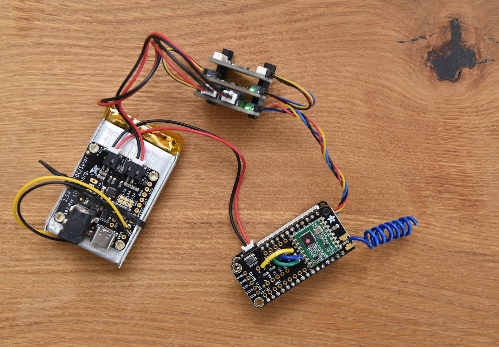

[](https://github.com/vladak/shield/actions/workflows/python-checks.yml)

# Shield

This repository contains CircuitPython code for ESP32 microcontrollers to measure temperature+humidity (and optionally CO2) and send the metrics to a MQTT broker via WiFi.
The microcontroller this was originally designed for is located outside on a balcony, running from a battery that is charged using a small solar panel.

This repository is called 'shield' as an allude to [Stevenson screen](https://en.wikipedia.org/wiki/Stevenson_screen) because
the Feather with the cicuitry is placed into a plastic screen, sometimes called "radiation shield": 



The cable running to the screen comes from the solar panel.

All in all, that's quite a lot of trouble and materials to get a simple sensor measurement from the outside.
However, I used that as a way to learn more about solar charging, [CircuitPython](https://circuitpython.org/), microcontrollers, electronics etc. and I mostly enjoyed the process of building it.

Eventually, I started using the same code for multiple Feathers/QtPys spread around the house.
Hence the support for multiple sensors.

## Hardware

Here is a bill of materials:

Purpose | Name
---|---
microcontroller | [ESP32 Feather ESP32-S2](https://www.adafruit.com/product/5303)
battery | [2000 mAh from Pimoroni](https://shop.pimoroni.com/products/lipo-battery-pack?variant=20429082247)
solar charger | [Adafruit Universal USB / DC / Solar Lithium Ion/Polymer charger - bq24074](https://www.adafruit.com/product/4755)
jack adapter for solar charger | [3.5mm / 1.1mm to 5.5mm / 2.1mm DC Jack Adapter](https://www.adafruit.com/product/4287)
solar panel | [6V 2W Solar Panel - ETFE - Voltaic P126](https://www.adafruit.com/product/5366)
extension cable | [2.1mm female/male barrel jack extension cable - 1.5m](https://www.adafruit.com/product/327)
battery gauge | [Adafruit MAX17048 LiPoly / LiIon Fuel Gauge and Battery Monitor - STEMMA JST PH](https://www.adafruit.com/product/5580)
thermistor | [Ultra Thin 10K Thermistor - B3950 NTC](https://www.adafruit.com/product/4890)
power jumper cables | [JST-PH 2-pin Jumper Cable - 100mm long](https://www.adafruit.com/product/4714)
temperature sensor | [Adafruit TMP117 ±0.1°C High Accuracy I2C Temperature Sensor - STEMMA QT](https://www.adafruit.com/product/4821)
humidity sensor | [Adafruit Sensirion SHT40 Temperature & Humidity Sensor - STEMMA QT / Qwiic](https://www.adafruit.com/product/4885)
radio | [Radio FeatherWing 433 MHz](https://www.adafruit.com/product/3230) 

Most of the stuff comes from [Adafruit](https://www.adafruit.com/).

## Genesis

### Temperature sensor

Initially, [Adafruit ESP32-S2 Feather with BME280 Sensor](https://www.adafruit.com/product/5303) was used.
This looked to be a fine all-in-one package, however initial experiments with temperature
readings using the built-in BME280 sensor showed that the skew of the metric due to the board being warmed up by 
the WiFi/SoC chip is too high - for ambient temperature of twenty/thirty-ish degrees of Celsius, the sensor
readings were forty-ish degrees of Celsius even though the code ran every couple of minutes to let the circuitry cool down.

Thus, I bought the [Adafruit TMP117 ±0.1°C High Accuracy I2C Temperature Sensor](https://www.adafruit.com/product/4821),
connected via STEMMA QT and this provides accurate temperature measurements.

Then the Feather was changed to [ESP32 Feather V2 with w.FL antenna connector](https://www.adafruit.com/product/5438)
and then back to ESP32-S2 along with converting the transport to RFM69 based radio.

### ESP32

After I put the code together to read the sensor data and send it to MQTT broker via WiFi, I bumped into [troubles with MQTT communication being stuck](https://forums.adafruit.com/viewtopic.php?t=193414). The MQTT library was merely a victim of some underlying firmware/network problem. I [solved the MQTT part](https://github.com/adafruit/Adafruit_CircuitPython_MiniMQTT/pull/117) which helped to avoid the stuck program, however did not help with getting the data to the local MQTT broker. The program running on the ESP32 was set to read the sensor data, publish them to MQTT broker and enter deep sleep for 5 minutes to conserve battery power. For a number of these 5 minute intervals, it did not manage to send the data successfully.

I suspected this is caused by some networking problem. Even though the ESP32 was located some 3 meters away from the WiFi access point and the MQTT broker was connected via Ethernet switched network to the AP, the communication was still not stable. So, a ESP32 that would be capable of running CircuitPython, had STEMMA QT and external antenna connector was needed. Luckily, I found [ESP32 Feather V2 with w.FL antenna connector](https://www.adafruit.com/product/5438). After I went through the hoops of installing CircuitPython on it (this ESP32 does not have built-in USB capabilities, so requires different workflow in order to upload files to its flash), and running initial tests, it is evident that the networking communication is way better - it no longer takes a significant latency to connect to WiFi (involves ARP, DHCP etc.).
Eventually though, even the Feather V2 started to get flaky and I returned to the Feather ESP32-S2 and replaced the WiFi with transmission using Radio Featherwing.
Had to use 2 distinct resellers across Europe to snatch the last pieces of the FeatherWing.
On the other hand it requires a dedicated radio gateway to pass the measurements further.

### Solar charging

Initially, I used a small freebie solar charger with built-in battery that supplied power via USB cable. It was not enough to charge the ESP32, and likely the battery had very small capacity because it laid in the storage for couple of years.

I wanted to monitor the capacity of the battery. In practice, that this metric will be published as MQTT message and eventually consumed by Grafana. This way, Grafana can provide alerting if the capacity drops too low. Since the [Adafruit bq24074 charger](https://www.adafruit.com/product/4755) does not provide such capability, I needed external battery monitor. Of course, ideally connected via STEMMA QT. Initially, for some reason, I chose [Adafruit LC709203F LiPoly / LiIon Fuel Gauge and Battery Monitor](https://www.adafruit.com/product/4712) even though it is no longer manufactured. This posed a bunch of challenges, in particular not being able to get the data from the sensor due to [some weird ESP/CircuitPython bug](https://forums.adafruit.com/viewtopic.php?p=947796), so I rather went with the newer [Adafruit MAX17048 gauge](https://www.adafruit.com/product/5580) instead.

At that point, I noted a hint of desperation and frustration in my mind - was not sure whether building this seemingly trivial project at that point is actually feasible given the hardware/software/firmware constraints.

To avoid charging the LiPo battery when freezing (which would damage it), I needed to solder a thermistor to the charger and fasten it to the battery so that the charger can measure the temperature of the battery. It has a built-in logic that prevents charging if the temperature of the battery is too low or too high. When soldering the thermistor, I chose the black wire to be ground, to match the [STEMMA QT convention](https://learn.adafruit.com/introducing-adafruit-stemma-qt/technical-specs).

As for sizing, this is something I will yet have to [figure out](https://forums.adafruit.com/viewtopic.php?p=946668), esp. during the winter.

After converting the transport to RFM69 based radio, the battery decerease over night is circa 5% with light sleep duration of 1 second and deep sleep duration of 30 seconds which means it could last nearly a month without charging.

#### Lessons learned

- during winter the amount of sun is minuscule compared to summer/spring. There is often a long sequence of cloudy days, when solar charging cannot do anything. As noted in [Adafruit discussion](https://forums.adafruit.com/viewtopic.php?p=578767), one has to have enough solar panels to charge the batteries enough when the sun finally goes out. And/or use batteries with much higher capacity.
- It is possible to connect multiple solar panels together, however that's not so easy because of the ["shaded panel" problem](https://forums.adafruit.com/viewtopic.php?p=416235). The solution is to use a *Schottky diode*.
- WiFi can be really flaky and is probably overkill (WiFi+DHCP+TCP+MQTT) for sending simple measurements. Simple radio transmission is much more simple and more energy efficient.

### Other uses

Over the time I added some ESP32-S2 based sensors powered via USB from a wall outlet. Also, I added support for more sensors.
This lead to the code being more generic.

### Physical packaging

Initially, it was just the ESP32 connected to external solar charger. Then I added temperature sensor, then swapped the ESP32 for another with external antenna, added solar charger, battery gauge and suddently it's a bunch of connected circuits.


To make this all fit inside the radiation shield, I used the [nylon screw and stand-off set](https://www.adafruit.com/product/3299) to fasten the sensors together and then I tucked that all inside the shield.


With the addition of the Radio FeatherWing (and conversion to Feather ESP32-S2):



Also I removed the zip tie as it made it harder to get the bundle in and out of the shield.

## Software/firmware install

Firstly, the microcontroller needs to be converted to run CircuitPython 9.x (for the `circup` to work with web workflow). To do that, for ESP32 V2, I chose the [command line `esptool`](https://learn.adafruit.com/circuitpython-with-esp32-quick-start/command-line-esptool) on a Linux computer (since macOS appeared to have flaky serial connection for some reason), however these days it can be done using [Web Flasher](https://adafruit.github.io/Adafruit_WebSerial_ESPTool/) in Chrome. For ESP32-S2 (QtPy) this procedure is simpler.

Once CicuitPython is installed, perform the initial set up by [creating the `settings.toml` file](https://learn.adafruit.com/circuitpython-with-esp32-quick-start/setting-up-web-workflow
) in the root directory (using `screen` when the board is connected via USB data cable):
```
f = open('settings.toml', 'w')
f.write('CIRCUITPY_WIFI_SSID = "wifissid"\n')
f.write('CIRCUITPY_WIFI_PASSWORD = "wifipassword"\n')
f.write('CIRCUITPY_WEB_API_PASSWORD = "XXX"\n')
f.close()
```
and restart the microcontroller. **This should not be done for the microcontroller using the radio transmission** to keep things simple and avoid any WiFi induced problems.

Then the following can be used:
- copy `*.py` files to the root directory:
  - web workflow, assumes system with `curl` installed:
  ```
  for f in *.py; do curl -v -u :XXX -T $f -L --location-trusted http://172.40.0.x/fs/$f; done
  ```
  - using USB mass storage (QtPy, Feather ESP32-S2), assumes Linux:
  ```
  cp *.py /media/$LOGNAME/CIRCUITPY/
  ``` 
- create `secrets.py` in the root directory (using the same technique as in the previous step)
- install necessary libraries from Adafruit CircuitPython bundle to the `lib` directory
  - For Feather ESP32 V2, web based workflow has to be used:
    ```
    circup --host 172.40.0.x --password XXX install -r requirements.txt
    ```
  - for ESP32-S2/ESP32-S3 and similar with USB mass storage access:
    ```
    circup install -r requirements.txt
    ```

## Pre-requisites

### radio to MQTT gateway

Use the [radio2mqtt](https://github.com/vladak/radio2mqtt).

### Prometheus MQTT exporter

The MQTT exporter is installed from the `prometheus-mqtt-exporter` package. Even though the package in Raspbian
lags behind the [upstream](https://github.com/hikhvar/mqtt2prometheus), it does the job.

The contents of `/etc/prometheus/mqtt-exporter.yaml` should look like this:

```yml
mqtt:
  # The MQTT broker to connect to
  server: tcp://localhost:1883
  # The Topic path to subscribe to. Be aware that you have to specify the wildcard.
  #
  # The structure used is 'devices/<location>/<sensor_name>'
  topic_path: devices/#
  # Optional: Regular expression to extract the device ID from the topic path. The default regular expression, assumes
  # that the last "element" of the topic_path is the device id.
  # The regular expression must contain a named capture group with the name deviceid
  # For example the expression for tasamota based sensors is "tele/(?P<deviceid>.*)/.*"
  #
  # The metrics are keyed on deviceid, so it needs to be unique.
  # This assumes that there are not multiple sensors sharing the same name in the same location.
  device_id_regex: "devices/(?P<deviceid>.*)"
  # The MQTT QoS level
  qos: 0
cache:
  # Timeout. Each received metric will be presented for this time if no update is send via MQTT.
  # Set the timeout to -1 to disable the deletion of metrics from the cache. The exporter presents the ingest timestamp
  # to prometheus.
  timeout: 15m
# This is a list of valid metrics. Only metrics listed here will be exported
metrics:
  -
    # The name of the metric in prometheus
    prom_name: temperature
    # The name of the metric in a MQTT JSON message
    mqtt_name: temperature
    # The prometheus help text for this metric
    help: temperature reading
    # The prometheus type for this metric. Valid values are: "gauge" and "counter"
    type: gauge
  -
    # The name of the metric in prometheus
    prom_name: humidity
    # The name of the metric in a MQTT JSON message
    mqtt_name: humidity
    # The prometheus help text for this metric
    help: humidity reading
    # The prometheus type for this metric. Valid values are: "gauge" and "counter"
    type: gauge
    # A map of string to string for constant labels. This labels will be attached to every prometheus metric
    #const_labels:
    #  sensor_type: dht22
  -
    # The name of the metric in prometheus
    prom_name: battery_level
    # The name of the metric in a MQTT JSON message
    mqtt_name: battery_level
    help: Battery level
    # The prometheus type for this metric. Valid values are: "gauge" and "counter"
    type: gauge
  -
    # The name of the metric in prometheus
    prom_name: co2_ppm
    # The name of the metric in a MQTT JSON message
    mqtt_name: co2_ppm
    # The prometheus help text for this metric
    help: CO2 ppm
    # The prometheus type for this metric. Valid values are: "gauge" and "counter"
    type: gauge
  -
    # The name of the metric in prometheus
    prom_name: lux
    # The name of the metric in a MQTT JSON message
    mqtt_name: lux
    # The prometheus help text for this metric
    help: illuminance in Lux
    # The prometheus type for this metric. Valid values are: "gauge" and "counter"
    type: gauge
```

### Prometheus

The MQTT exporter by itself sets the `sensor` tag to the last component of the topic,
which in this case is the device name. To get also the location (2nd component of the topic), 
re-labeling in Prometheus itself is used.

Under the `scrape_configs` section in `/etc/prometheus/prometheus.yml` there should be:
```yml

  - job_name: mqtt
    # If prometheus-mqtt-exporter is installed, grab metrics from external sensors.
    static_configs:
      - targets: ['localhost:9641']
    # The MQTT based sensor publish the data only now and then.
    scrape_interval: 1m
    # Add the location as a tag.
    metric_relabel_configs:
     - source_labels: [topic]
       target_label: location
       regex: 'devices/([[:alnum:]]*)/[[:alnum:]]*'
       action: replace
       replacement: "$1"

```

## Configuration

There needs to be a `secrets.py` file. For Wifi based transport it contains Wi-Fi credentials and information about the MQTT broker.

It can look like this:
```python
# This file is where you keep secret settings, passwords, and tokens!
# If you put them in the code you risk committing that info or sharing it

secrets = {
    "ssid": "foo",
    "password": "bar",
    "broker": "172.40.0.3",
    "broker_port": 1883,
    "mqtt_topic": "devices/terasa/shield",
    "log_topic": "logs/terasa/shield",
    "deep_sleep_duration": 300,
    "log_level": "INFO",
}
```

Even though radio transport can be used, the WiFi tunables are still mandatory. See the table below.

If the radio transport is active, instead of WiFi, none of the MQTT related tunables will be used.

To transfer the file to the microcontroller, the same method as in the Install section should be used.

### Tunables

Purpose | Name                                                                                                                                              | Type | Kind
---|---------------------------------------------------------------------------------------------------------------------------------------------------|---|---
`ssid` | WiFi SSID                                                                                                                                         | `str` | Mandatory
`password` | WiFi password                                                                                                                                     | `str` | Mandatory
`broker` | MQTT broker address                                                                                                                               | `str` | Mandatory
`broker_port` | MQTT broker port                                                                                                                                  | `int` | Mandatory
`mqtt_topic` | MQTT topic to publish messages to                                                                                                                 | `str` | Mandatory
`log_topic` | MQTT topic to publish log messages to                                                                                                             | `str` | Optional
`log_level` | log level, default `INFO`                                                                                                                         | `str` | Mandatory
`deep_sleep_duration` | how long to deep sleep, in seconds. Used only when running on battery.                                                                  | `int` | Mandatory
`light_sleep_duration` | how long to light sleep, in seconds, default 10. Used only when running on battery.                                                    | `int` | Optional
`sleep_duration_short` | how long to deep sleep (in seconds) if battery is charged above `battery_capacity_threshold`. Should be smaller than the default `deep_sleep_duration`. This is also used when **not** running on battery power as a MQTT loop timeout. | `int` | Optional
`battery_capacity_threshold` | battery capacity high threshold, in percent                                                                                                       | `int` | Optional
`tx_power` | TX power to use if RFM69                                                                                                                          | `int` | Optional
`encryption_key` | 16 bytes of encryption key if RFM69                                                                                                               | `bytes` | Optional
`light_gain` | used to set light gain for VEML7700 light sensor. Can be either 1 or 2                                                                           | `int` | Optional

## Guide/documentation links

Adafruit has largely such a good documentation that the links are worth putting here for quick reference:
- [SHT40 guide](https://learn.adafruit.com/adafruit-sht40-temperature-humidity-sensor/python-circuitpython)
- [MAX17048 guide](https://learn.adafruit.com/adafruit-max17048-lipoly-liion-fuel-gauge-and-battery-monitor)
- [web workflow RESTful API](https://docs.circuitpython.org/en/latest/docs/workflows.html#file-rest-api)
- [CircuitPython RGB Status Light color coding](https://learn.adafruit.com/welcome-to-circuitpython/troubleshooting#circuitpython-rgb-status-light-2978455)
- [CircuitPython for RFM69](https://learn.adafruit.com/radio-featherwing/circuitpython-for-rfm69)
- VEML7700: [light levels](https://learn.adafruit.com/adafruit-veml7700/adjusting-for-different-light-levels) and [their adjustment](https://docs.circuitpython.org/projects/veml7700/en/latest/api.html#adafruit_veml7700.VEML7700.light_gain)

## Lessons learned

- get larger solar panel than what you think you will need
- make the code as simple as possible; this will contribute to the robustness
- make it robust
  - catch any possible exception on the global level and react accordingly (reset/exit)
  - use [`safemode.py`](https://learn.adafruit.com/circuitpython-safe-mode/safemode-py) to reset the board if something goes wrong
- the shape and orientation of the antenna on the sender and receiver matters
  - [ideally they should have the same shape and be parallel]((https://forums.adafruit.com/viewtopic.php?t=210956)) although in this case, straight antenna bent to fit the shield works quite well with spring antenna on the MQTT gateway
